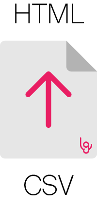

<p align="center"></p>
<h3 align="center">csv2html</h3>
<p align="center"><i>Easy Node.JS package & CLI for CSV to HTML conversion</i><p>

<p align="center">
  <a href="https://forthebadge.com">
    
  </a>
  <a href="https://forthebadge.com">
    
  </a>
  <a href="https://github.com/Leafgard/csv2html/issues">
    
  </a>
  <a href="https://github.com/Leafgard/csv2html/stargazers">
    
  </a>
  <a href="https://paypal.me/Leafgard">
    
  </a>
</p>

<p align="center">
  <a href="#features">Features</a> •
  <a href="#installation">Installation</a> •
  <a href="#usage">Usage</a> •
  <a href="#license">License</a>
</p>

## Features

* Converts CSV to HTML as Node.JS package or CLI
* Ability to choose the delimiter
* Converts CSV to HTML fast (± 1s / 200000 lines) - Average on Macbook Pro 2018 w/ i7

## Installation

```bash
# CLI
$ npm i -g @leafgard/csv2html
# Package
$ npm i @leafgard/csv2html
```

## Usage

### CLI

Here is a basic CLI usage example:

```bash
$ csv2html -i input.csv -o output.csv
```

You can provide options like:

- `-d`: CSV parsing delimiter, f.e: `-d ';'`
- `-t`: Transforms table to HTML document with provided title, f.e: `-t 'My document'`

### Package

Here is a basic usage example as a Node.JS package:

```js
const CSV2HTML = require('@leafgard/csv2html')

CSV2HTML
  .setOptions({
    csvDelimiter: ';',
    htmlTitle: 'My document'
  }) // (Optional)

  .setInputFile('data.csv')
  .setOutputFile('output.csv')

  .convert().then(() => {
    // Do something
  }).catch((err) => {
    // Catch error
  })

```

## License

This project is licensed under the MIT License - see the [LICENSE.md](LICENSE.md) file for details.
